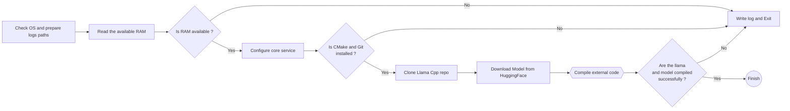
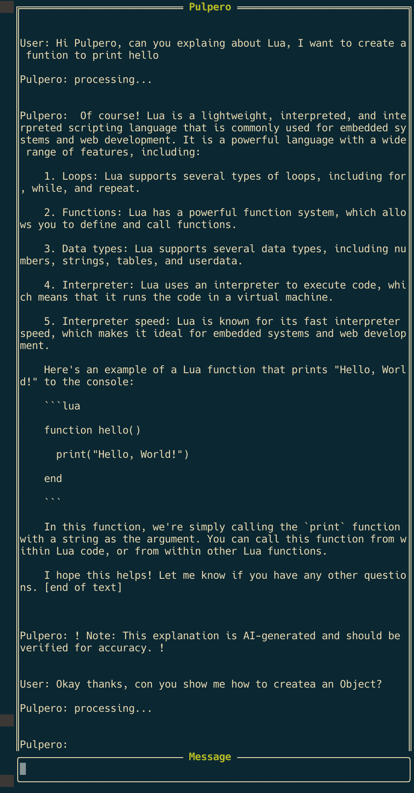
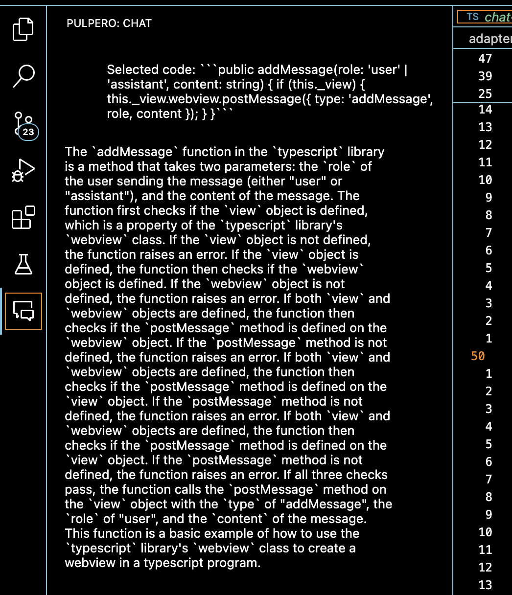
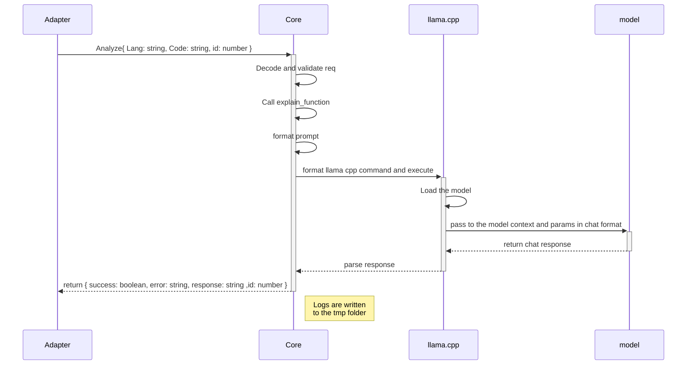

# Pulpero

### ⚠️  Important Responsibility Notice

**DISCLAIMER**: This software uses AI models to generates analysis and suggestions. The owner and contributors of the code are not responsible for any results, suggestions, or analysis generated by the software. All responses and suggestions must be carefully verified by the end user, as they are generated by an AI model and may contain errors or inaccuracies. Use of this software is at your own risk.

## 😊 What's in this repo?

This repository contains code for a multi-IDE and multi-platform plugin that analyzes code and its functionality. It's designed to be native to Neovim but includes adapters for IDEs such as IntelliJ, WebStorm, and VScode. The goal is to offer an experience similar to Copilot but without requiring an internet connection or exposing your code to third parties.

## 😌 Content

- [The Name](#The-Name)
- [The Model](#The-Model)
- [Requirements](#Requirements)
- [Installation](#Installation)
    - [Lazy (Neovim)](#NeoVim)
    - [Adapters](#Adapter)
      - [VScode](#VScode)
      - [IntelliJ](#IntelliJ)
      - [WebStorm](#WebStorm)
   - [REST API](#API)
   - [Docker](#Docker)
   - [Troubleshooting](#Logs)
- [The future](#TODO)
- [How It works](#Explanation)

<div id="The-Name" />

### 🦶 Why the name Pulpero?

Pulpero refers to the Pulperías (old general stores) of old Buenos Aires. The pulperos were the owners of these establishments who used to give advice to people who came to drink or spend time in their store. I thought it was an appropriate name for an AI that offers code advice.

<div id="How-To-Use-It" />

## 🤨 How to use it?

- In IDEs: Highlight the code you want to analyze, right-click, and select "Explain Code With Pulpero". Or you can query the model with the live-chat
- In Neovim: Select the code in visual mode and execute the PulperoExpFn command. To open the chat you can use the commands PulperoOpenChat.
- Using the REST API: Make a POST request to http://localhost:8080/explain. The body should contain the code to analyze, and the query param 'lang' should specify the language.

**Note**: For the moment, the maximum number of lines to analyze is 100, this is due to a constraint in the context size of the model.

<div id="The-Model" />

## 🤖 The model

Currently Pulpero use TinyLlama 1b model as an experiment to run in almost any machine and in multiple IDEs. Thanks to *TheBloc*k at Huggingface to provide this model in gguf format.

[URL to the model](https://huggingface.co/TheBloke/TinyLlama-1.1B-Chat-v1.0-GGUF)

**Note**: We have plan to migrate to CodeLLama 7b in the future.

<div id="Requirements" />

### 📋 Requirements

- Lua latest version
- A minimum of 4 GB of RAM Free
- Git latest version
- Wget latest version
- Have CMake already installed is a plus

<details>
  <summary>Performance</summary>

PENDING: Testing is in progress 🫣 (On my MAC works)

</details>

<div id="Installation" />

### 📦 Local Installation

For local installation, run the script corresponding to your operating system:

🌕 *MacOS*
```bash
chmod +x install.sh && ./install.sh
```

🐧 *Linux*
```bash
chmod +x install_linux.sh && ./install_linux.sh
```

🪟 *Windows*
```powershell
install.ps1
```

These scripts handle:
1. Downloading and configuring Lua in your operating system
2. Installing LuaRocks as package manager
3. Installing Milua, the miniframework used to create the REST API

Once dependencies are installed, run in the repository root:

```bash
lua ./lua/pulpero/core/init.lua
```

This will start the server at http://localhost:8080/. To verify it's working, access the base URL, which should respond with the message "The server is running".

### Setup flow chart



<div id="NeoVim" />

### 👾 Lazy Configuration for Neovim

There are two ways to install the repository with Lazy:

1. For local development (if you want to make modifications):
```lua
{ 'Pulpero', dir="~/path/to/repo/Pulpero", opts = {} },
```

2. For direct installation from GitHub:
```lua
{ 'AgustinAllamanoCosta/Pulpero', opts = {} },
```

The second option will keep you updated with the latest version of the repository.

### 💻 Nvim Commands
<details>
  <summary> Some useful commands you can use</summary>

To tell to the model to explain some line/s of code, you can highlight it and execute "PulperoExpFn"

```
:PulperoExpFn
```

To open the chat bar "PulperoOpenChat"

```
:PulperoOpenChat
```



To close the chat bar "PulperoClosenChat"

```
:PulperoCloseChat
```

To send the inputs characters in to the chat model use "PulperoSendChat"

```
:PulperoSendChat
```

To clear the model cache you can use "PulperoClearModelCache"

```
:PulperoClearModelCache
```
</details>

<div id="Adapters" />

### ⭐️ Configuration for other IDEs

<div id="IntelliJ" />
<details>
  <summary>IntelliJ:</summary>
PENDING
</details>


<div id="VScode" />
<details>
  <summary>VScode:</summary>
To install the adapter for VScode you need to download a .vsix file to install manually (the vscode version is not publish yet on the VScode marketplace)

To download a vsix file go to the [releases section](https://github.com/AgustinAllamanoCosta/Pulpero/releases)

Once you have the .vsix file open VScode and go to Extension then next to the `Extension` title you have `...` icon, click on it and then click in the `Install from VSIX...` on the dropdown menu. Then on the file explorer select the .vsix file and that it!

The plugin adapter will prepare the environment, download the latest version of the core, run the setup functions and spawn a Lua process with the service interface for the core.

If all went well you now can access the chat in the left side bar.



If you want to run a specific version of the core, you can download it from the repo and then in the settings section of the plugin you need to:

- Tick Pulpero: Local
- Configured Pulpero: Core Path with the absolute path to the folder where you download the tar.gz of the core. e.g `/Users/agustinallamanocosta/repo/personal/AI/Pulpero/`
- Rename the downloaded core-{version}-tar.gz file to core-local.tar.gz

With this configuration now the plugin run a local version of the core.

</details>

<div id="WebStorm" />
<details>
  <summary>WebStorm:</summary>
PENDING
</details>

<div id="API" />

### 🤖 REST API

The API currently offers two basic endpoints. This API is primarily designed for testing and development, IT IS NOT RECOMMENDED FOR PRODUCTION ENVIRONMENTS as it does not implement security validations.

#### 🛜 Available Endpoints:

<details>
  <summary>Definition</summary>

1. **Healthcheck**
   - URL: `http://localhost:8080/`
   - Method: GET
   - Response: "The server is running"

2. **Code Analysis**
   - URL: `http://localhost:8080/explain`
   - Method: POST
   - Body: String with code to analyze
   - Query params: `lang` (code language type)
</details>

<div id="Docker" />

### 🐳 Docker Image

*PENDING*

<div id="Logs" />

### 😅 Troubleshooting

The plugin generates logs in the user's `/tmp` folder:
(The location of the tmp folder is different from each OS you need to look for the correct tmp path base on you OS)

- **pulpero_debug.log**: Records core steps during analysis, configuration, prompts, and model responses.
- **pulpero_setup.log**: Documents plugin initialization steps.
- **pulpero_command.log**: Shows model engine information (llama.cpp).
- **pulpero_error.log**: Records unexpected errors.

Logs are recreated with each request to maintain a controlled size and facilitate debugging of the last execution.

<div id="TODO" />

### 🚨 TODO List
- ❌ Create a docker image of the core
- ❌ Create the IntelliJ adapter
- ❌ Create WebStorm adapter
- ✅ Create VSCode adapter
- ✅ Improve UI
- ✅ Improve core performance
- ✅ Improve response format
- ✅ Add query history
- ✅ Add a refactor query
- ✅ Add unit test of the core functions
- ✅ Add integration test of the core functions
- ✅ Add more configuration options for nvim commands
- ❌ Add unit test generation base of function and context
- ✅ Add a live chat to interact with the model
- 🚧 Add context of the current file for better understanding
- 🚧 Add live feedback
- ❌ Add pairing mode as a companion for developing a feature
- 🚧 Add the docker build and publish process to the CI pipeline
- ❌ Add test on the CI pipeline
- ❌ Migrate to a CodeLlama
- ❌ Add live feedback with audio for coding

*References*:

❌ Pending

✅ Done

🚧 Working on it

<div id="Explanation" />

## 🤔 How does it work?

Pulpero consists of three main parts:

1. **Lua Core**: Designed primarily for Neovim, it handles:
   - Downloading and configuring the model (currently using TinyLlama-1.1B-Chat)
   - Configuring Llama.cpp as execution engine
   - Managing model parameters
   - Formatting prompts and processing responses
   - Service to be spawn for the different adapters

2. **IDE Adapters**: IDEs other than Neovim spawn a lua services of the core and send request to it in JSON format.

3. **Llama Engine**: To run models locally in the most efficient way.

The presentation of responses may vary depending on the adapter or interface used, but the integrity of the information generated by the model is always maintained.

### General Interaction Diagram


