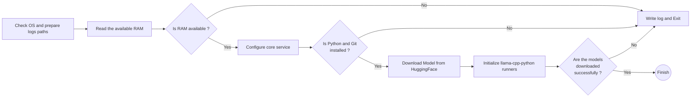
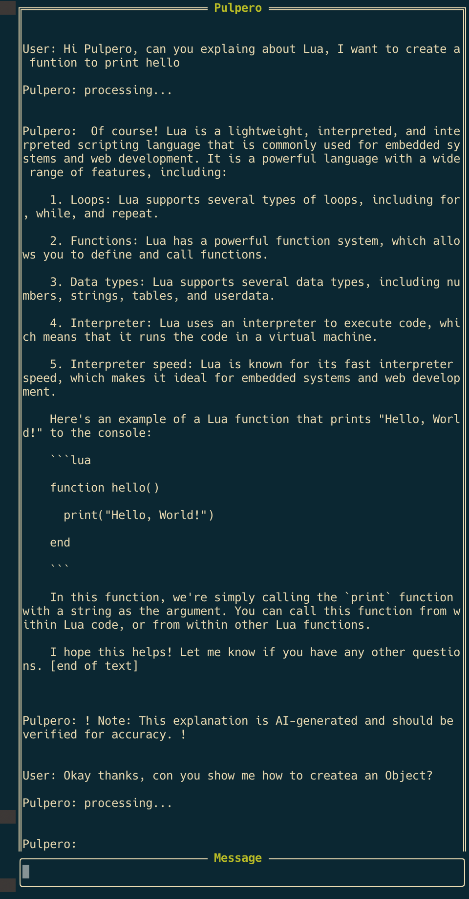
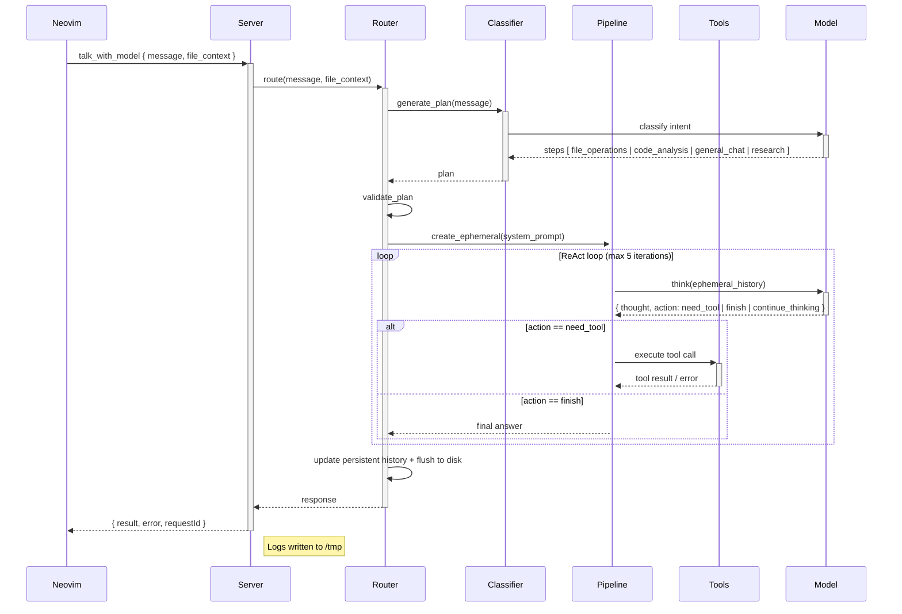

# Pulpero

### ⚠️  Important Responsibility Notice

**DISCLAIMER**: This software uses AI models to generate analysis and suggestions. The owner and contributors of the code are not responsible for any results, suggestions, or analysis generated by the software. All responses and suggestions must be carefully verified by the end user, as they are generated by an AI model and may contain errors or inaccuracies. Use of this software is at your own risk.

## 😊 What's in this repo?

This repository contains a local AI assistant designed to help with daily coding tasks. It runs natively in Neovim and is built around a Python backend that runs AI models entirely on your machine — no internet connection required, no code sent to third parties.

## 😌 Content

- [The Name](#The-Name)
- [The Model](#The-Model)
- [Requirements](#Requirements)
- [Installation](#Installation)
    - [Lazy (Neovim)](#NeoVim)
    - [REST API](#API)
    - [Docker](#Docker)
    - [Troubleshooting](#Logs)
- [The future](#TODO)
- [How It works](#Explanation)

<div id="The-Name" />

### 🦶 Why the name Pulpero?

Pulpero refers to the Pulperías (old general stores) of old Buenos Aires. The pulperos were the owners of these establishments who used to give advice to people who came to drink or spend time in their store. I thought it was an appropriate name for an AI that offers code advice.

<div id="How-To-Use-It" />

## 🤨 How to use it?

- In Neovim: Select the code in visual mode and execute the `PulperoExpFn` command. To open the chat use `PulperoOpenChat`.
- Using the REST API: Make a POST request to `http://localhost:8080`. The body should contain the code to analyze, and the query param `lang` should specify the language.

**Note**: For the moment, the maximum number of lines to analyze is 700, due to a constraint in the context size of the model.

<div id="The-Model" />

## 🤖 The model

Pulpero uses multiple local models via llama-cpp-python, each specialized for a different task:

- **Chat / ReAct reasoning**: General conversation, planning and multi-step thinking
- **Code analysis**: Code-specific tasks and suggestions
- **Classification**: Intent detection to route requests to the right pipeline
- **Tool execution**: File operations, project exploration, and web search

All models run locally using llama.cpp bindings.

<div id="Requirements" />

### 📋 Requirements

- Python 3.13+
- Lua latest version
- A minimum of 4 GB of RAM free
- Git latest version
- Wget latest version
- Have CMake already installed is a plus
- `duckduckgo-search` Python package (for web search: `pip install duckduckgo-search`)

<details>
  <summary>Performance</summary>

PENDING: Testing is in progress 🫣 (On my MAC works)

</details>

<div id="Installation" />

### 📦 Local Installation

For local installation, run the script corresponding to your operating system:

🌕 *MacOS*
```bash
chmod +x install.sh && ./install.sh
```

🐧 *Linux*
```bash
chmod +x install_linux.sh && ./install_linux.sh
```

These scripts handle:
1. Downloading and configuring Lua and Python dependencies
2. Installing llama-cpp-python and required packages
3. Downloading and configuring the local AI models

Once dependencies are installed, run in the repository root:

```bash
lua ./lua/pulpero/init.lua
```

This will start the socket server. To verify it's working, check the logs in `/tmp/pulpero_setup.log`.

### Setup flow chart


```mermaid
   flowchart LR
      Start[Check OS and prepare logs paths]
      Error[Write log and Exit]
      Core1[Configure core service]
      Core2[Download Model from HuggingFace]
      Core3[Initialize llama-cpp-python runners]
      De1{Is RAM available ?}
      De2{Is Python and Git <br/>installed ?}
      De3{Are the models <br/>downloaded <br/>successfully ?}
      Stop((Finish))
      OS[Read the available RAM]
      Start-->OS
      OS-->De1
      De1-->|Yes| Core1
      De1-->|No| Error
      Core1-->De2
      De2-->|No| Error
      De2-->|Yes| Core2
      Core2-->Core3-->De3
      De3-->|Yes| Stop
      De3-->|No| Error
```

<div id="NeoVim" />

### 👾 Lazy Configuration for Neovim

There are two ways to install the repository with Lazy:

1. For local development (if you want to make modifications):
```lua
{ 'Pulpero', dir="~/path/to/repo/Pulpero", opts = {} },
```

2. For direct installation from GitHub:
```lua
{ 'AgustinAllamanoCosta/Pulpero', opts = {} },
```

### 💻 Neovim
<details>
  <summary>Some useful commands you can use</summary>

To open the chat bar:
```
:PulperoOpenChat
```



To close the chat bar:
```
:PulperoCloseChat
```

To send input to the chat model:
```
:PulperoSendChat
```

To clear the model cache:
```
:PulperoClearModelCache
```

To disable Pulpero (the core will still run in the background):
```
:PulperoDisable
```

To enable Pulpero:
```
:PulperoEnable
```

</details>

<details>
  <summary>Some videos showing the plugin being used</summary>

Using the chat

<video width="500" height="500" controls>
  <source src="./doc/Pulpero1.mov" type="video/mp4">
</video>

</details>

<div id="API" />

### 🤖 REST API

The API currently offers two basic endpoints. This API is primarily designed for testing and development, IT IS NOT RECOMMENDED FOR PRODUCTION ENVIRONMENTS as it does not implement security validations.

#### 🛜 Available Endpoints:

<details>
  <summary>Definition</summary>

1. **Healthcheck**
   - URL: `http://localhost:8080/`
   - Method: GET
   - Response: "The server is running"

2. **Code Analysis**
   - URL: `http://localhost:8080/explain`
   - Method: POST
   - Body: String with code to analyze
   - Query params: `lang` (code language type)
</details>

<div id="Docker" />

### 🐳 Docker Image

*PENDING*

<div id="Logs" />

### 😅 Troubleshooting

The plugin generates logs in the user's `/tmp` folder:
(The location of the tmp folder differs by OS — find the correct path for your system)

- **pulpero_debug.log**: Records core steps during analysis, configuration, prompts, and model responses.
- **pulpero_setup.log**: Documents plugin initialization steps.
- **pulpero_command.log**: Shows model engine information (llama.cpp).
- **pulpero_error.log**: Records unexpected errors.

Logs are recreated with each request to maintain a controlled size and facilitate debugging of the last execution.

<div id="TODO" />

### 🚨 TODO List

- ❌ Improve chat history (compression / summarization of past context)
- ❌ Add unit test generation based on function and context
- ❌ Add IDE project awareness
- ❌ Publish Docker image
- ✅ Migrate core to Python
- ✅ Create a Docker image of the core
- ✅ Improve model download process
- ✅ Improve UI
- ✅ Improve core performance
- ✅ Improve response format
- ✅ Add query history
- ✅ Add a refactor query
- ✅ Add more configuration options for Neovim commands
- ✅ Add a live chat to interact with the model
- ✅ Add context of the current file for better understanding
- ✅ Add live feedback
- ✅ Add pairing mode as a companion for developing a feature
- ✅ Add the docker build and publish process to the CI pipeline
- ✅ Improve Neovim's UI
- ✅ Refactor model download to be handled by the service
- ✅ Refactor all model runner calls to be handled by the service
- ✅ Fix tool parsing multi params
- ✅ Add ReAct pattern for multi-step reasoning and tool use
- ✅ Add file operation tools (create, read, find)
- ✅ Add intent classification and plan validation
- ✅ Add persistent conversation history (survives restarts)
- ✅ Add ephemeral pipeline histories (tool calls and reasoning stay isolated)
- ✅ Add project context tools (list_directory, get_file_tree)
- ✅ Add web search tool and research pipeline (DuckDuckGo)

*References*:

❌ Pending

✅ Done

🚧 Working on it

<div id="Explanation" />

## 🤔 How does it work?

Pulpero consists of two main parts:

1. **Lua Core** (`lua/pulpero/`): The Neovim-native plugin that handles:
   - UI: chat window, virtual text overlays, real-time feedback
   - Service connector: communicates with the Python backend over a socket

2. **Python Backend** (`core/`): The AI engine that handles all reasoning:
   - **Router**: Classifies intent and routes to the right pipeline
   - **ReAct Loop**: Multi-step reasoning with tool use — the model thinks, calls tools, and refines its answer
   - **Runners**: Multiple specialized `llama-cpp-python` model instances for different tasks
   - **Tool Manager**: Tools the model can call during reasoning (see below)
   - **History Manager**: Persistent conversation context with ephemeral pipeline isolation
   - **Socket Server**: Accepts JSON-RPC requests from the Lua plugin

### Pipelines

| Pipeline | Trigger | What it does |
|---|---|---|
| `file_operations` | Read/write/find files | Orchestrates file tools, passes gathered context forward |
| `code_analysis` | Explain/review/debug code | Deep code reasoning with file access |
| `general_chat` | Questions, concepts | Conversational responses using conversation history |
| `research` | External docs, current events | Web search + synthesis into summary + sources |

### Tools

| Tool | Description |
|---|---|
| `get_file` | Read file content by path |
| `find_file` | Search for files by name recursively |
| `create_file` | Write a new file at a given path |
| `list_directory` | List files and subdirectories at a path (one level) |
| `get_file_tree` | Recursive project tree up to a configurable depth |
| `web_search` | DuckDuckGo search — returns title, URL, and snippet per result |

### History

Conversation history is split into two layers:

- **Persistent** (`~/.local/share/pulpero/history.json`): Stores only user messages and final assistant responses. Survives restarts.
- **Ephemeral**: Created fresh for each pipeline call, seeded with the persistent turns. System prompts, tool calls, and ReAct reasoning stay isolated here and are discarded after the pipeline returns.

### Architecture

```
Neovim (Lua plugin)
    ↓  JSON-RPC over socket
Python Backend (Socket Server)
    ↓
Methods → Router
    ↓
┌─────────────────────────────────────────┐
│  Classification Runner  (intent → plan) │
│  ReAct Runner           (think/act loop)│
│  Code Runner            (code analysis) │
│  Chat Runner            (conversation)  │
│  Tool Runner            (tool calls)    │
└─────────────────────────────────────────┘
    ↓
llama-cpp-python → Local Models (.gguf)
```

### Request Flow


```mermaid
   sequenceDiagram
      participant Neovim
      participant Server
      participant Router
      participant Classifier
      participant Pipeline
      participant Tools
      participant Model

      Neovim->>+Server: talk_with_model { message, file_context }
      Server->>+Router: route(message, file_context)
      Router->>+Classifier: generate_plan(message)
      Classifier->>+Model: classify intent
      Model-->>-Classifier: steps [ file_operations | code_analysis | general_chat | research ]
      Classifier-->>-Router: plan
      Router->>Router: validate_plan
      Router->>+Pipeline: create_ephemeral(system_prompt)
      loop ReAct loop (max 5 iterations)
          Pipeline->>+Model: think(ephemeral_history)
          Model-->>-Pipeline: { thought, action: need_tool | finish | continue_thinking }
          alt action == need_tool
              Pipeline->>+Tools: execute tool call
              Tools-->>-Pipeline: tool result / error
          else action == finish
              Pipeline-->>Router: final answer
          end
      end
      Router->>Router: update persistent history + flush to disk
      Router-->>-Server: response
      Server-->>-Neovim: { result, error, requestId }
      Note right of Server: Logs written to /tmp
```
